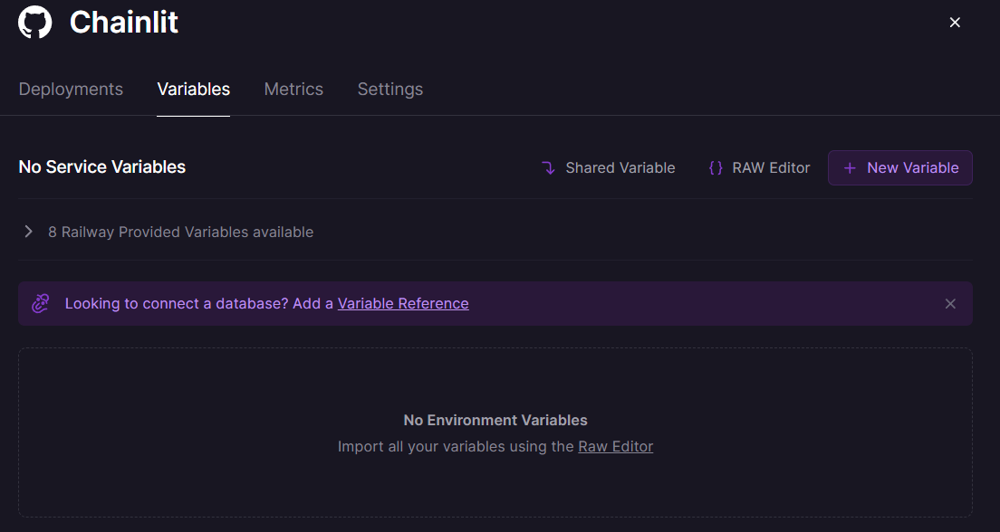

# Chainlit in Railway 👋

**Deploy production-ready Conversational AI applications with Railway in minutes, not weeks ⚡️**

[Chainlit](https://github.com/Chainlit/chainlit) is an open-source async Python framework which allows developers to build scalable Conversational AI or agentic applications.

> **Requirements**: Python >= 3.10

- ✅ ChatGPT-like application
- ✅ Embedded Chatbot & Software Copilot
- ✅ Custom frontend (build your own agentic experience)
- ✅ API Endpoint

## Deploy

For a step-by-step guide to deploying on [Railway](https://railway.app/template/atS4DW?referralCode=jk_FgY), see [this]() post, or click the button below.

🔑 Please ensure to add an environment variable "OPENAI_API_KEY" for your OpenAI API key in the Railway deployment console when deploying the app to enable the Chatbot streaming.

